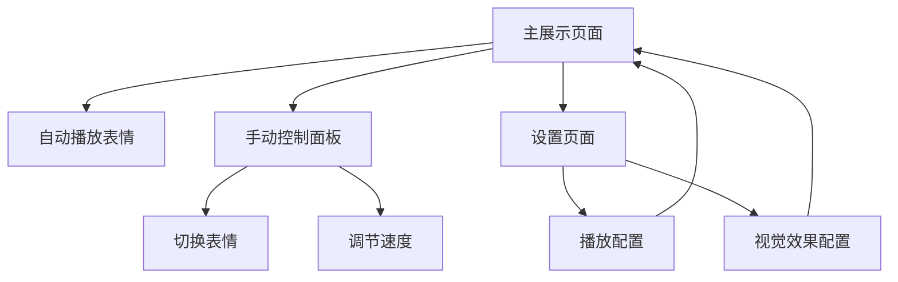

## 1. Product Overview
拉斯维加斯巨型球动态表情展示页面是一个模拟真实拉斯维加斯巨型球视觉效果的Web应用。该项目旨在创建一个具有科技感和视觉冲击力的动态表情展示系统，通过圆形LED屏幕效果展示各种表情动画。
- 核心目标：为用户提供沉浸式的视觉体验，重现拉斯维加斯巨型球的震撼效果
- 应用场景：娱乐展示、数字艺术、互动体验等领域

## 2. Core Features

### 2.1 Feature Module
我们的拉斯维加斯巨型球项目包含以下主要页面：
1. **主展示页面**：圆形巨型球容器、表情动画播放区域、控制面板
2. **设置页面**：播放速度调节、表情库管理、显示效果配置

### 2.2 Page Details

| Page Name | Module Name | Feature description |
|-----------|-------------|---------------------|
| 主展示页面 | 圆形巨型球容器 | 创建大型圆形显示区域，模拟真实巨型球外观，包含LED像素效果和边框光晕 |
| 主展示页面 | 表情动画播放 | 循环播放多种表情动图，支持平滑过渡切换，包含淡入淡出效果 |
| 主展示页面 | 控制面板 | 提供播放/暂停、上一个/下一个、速度调节等控制功能 |
| 主展示页面 | 状态指示器 | 显示当前播放状态、表情名称、播放进度等信息 |
| 设置页面 | 播放配置 | 调节自动播放间隔、过渡动画时长、循环模式等参数 |
| 设置页面 | 视觉效果 | 配置LED亮度、色彩饱和度、边框光效、背景主题等 |

## 3. Core Process

**用户操作流程：**
用户访问页面后，巨型球自动开始播放表情动画。用户可以通过控制面板手动切换表情、调节播放速度，或进入设置页面自定义显示效果。所有操作都具有平滑的视觉反馈。

## 4. User Interface Design

### 4.1 Design Style
- **主色调**：深黑色背景 (#000000)，霓虹蓝 (#00FFFF)，电光紫 (#8A2BE2)
- **按钮风格**：发光边框，悬停时亮度增强，点击时脉冲效果
- **字体**：现代科技感字体，建议使用 'Orbitron' 或 'Exo 2'，主要尺寸 16px-24px
- **布局风格**：居中对称布局，圆形元素为主，LED点阵效果
- **图标风格**：线性图标配合发光效果，使用 Font Awesome 或自定义 SVG

### 4.2 Page Design Overview

| Page Name | Module Name | UI Elements |
|-----------|-------------|-------------|
| 主展示页面 | 圆形巨型球容器 | 大型圆形容器(80vmin)，渐变边框，内部LED像素网格，脉冲光晕动画 |
| 主展示页面 | 表情动画区域 | 居中表情显示，尺寸自适应，淡入淡出过渡(0.5s)，支持emoji和图片 |
| 主展示页面 | 控制面板 | 底部横向布局，发光按钮，播放/暂停/前进/后退，速度滑块 |
| 主展示页面 | 状态显示 | 顶部信息栏，当前表情名称，播放进度条，时间显示 |
| 设置页面 | 配置面板 | 侧边栏布局，分组设置项，滑块和开关控件，实时预览效果 |

### 4.3 Responsiveness
采用移动优先的响应式设计，桌面端展示完整功能，移动端优化触摸交互。巨型球在小屏幕上保持圆形比例，控制面板自动调整为垂直布局。支持横屏和竖屏模式切换。