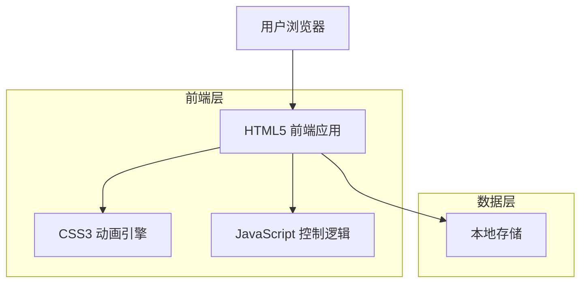
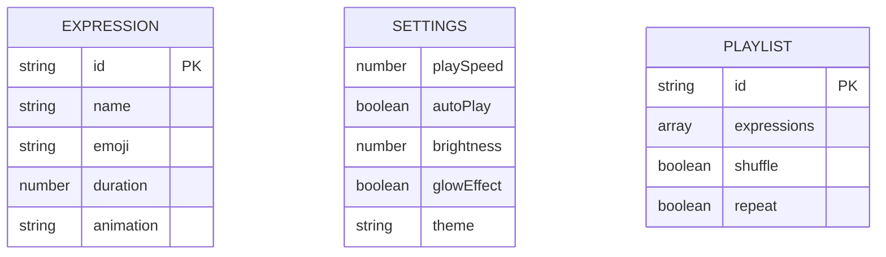

## 1.Architecture design



## 2.Technology Description

* 前端：HTML5 + CSS3 + 原生JavaScript + Canvas API

* 后端：无需后端服务

## 3.Route definitions

| Route     | Purpose          |
| --------- | ---------------- |
| /         | 主展示页面，显示巨型球和表情动画 |
| /settings | 设置页面，配置播放参数和视觉效果 |

## 4.API definitions

### 4.1 本地存储API

**保存用户设置**

```javascript
// 保存配置到localStorage
localStorage.setItem('sphereSettings', JSON.stringify(settings))
```

参数说明：

| Param Name | Param Type | Description       |
| ---------- | ---------- | ----------------- |
| playSpeed  | number     | 播放速度 (500-5000ms) |
| autoPlay   | boolean    | 是否自动播放            |
| brightness | number     | LED亮度 (0-100)     |
| glowEffect | boolean    | 是否启用光晕效果          |

**表情数据结构**

```javascript
{
  "id": "happy",
  "name": "开心",
  "emoji": "😊",
  "duration": 2000,
  "animation": "bounce"
}
```

## 5.数据模型

### 5.1 数据模型定义



### 5.2 数据定义

**表情数据 (expressions.js)**

```javascript
// 表情库定义
const EXPRESSIONS = [
    {
        id: 'happy',
        name: '开心',
        emoji: '😊',
        duration: 2000,
        animation: 'bounce'
    },
    {
        id: 'love',
        name: '爱心',
        emoji: '😍',
        duration: 2500,
        animation: 'pulse'
    },
    {
        id: 'cool',
        name: '酷炫',
        emoji: '😎',
        duration: 3000,
        animation: 'rotate'
    },
    {
        id: 'party',
        name: '派对',
        emoji: '🥳',
        duration: 2000,
        animation: 'shake'
    },
    {
        id: 'fire',
        name: '火焰',
        emoji: '🔥',
        duration: 2500,
        animation: 'flicker'
    }
];

// 默认设置
const DEFAULT_SETTINGS = {
    playSpeed: 2000,
    autoPlay: true,
    brightness: 80,
    glowEffect: true,
    theme: 'neon',
    transitionDuration: 500
};
```

**动画配置 (animations.js)**

```javascript
// CSS动画关键帧定义
const ANIMATIONS = {
    bounce: {
        keyframes: '@keyframes bounce { 0%, 100% { transform: scale(1); } 50% { transform: scale(1.2); } }',
        duration: '1s',
        timing: 'ease-in-out',
        iteration: 'infinite'
    },
    pulse: {
        keyframes: '@keyframes pulse { 0%, 100% { opacity: 1; } 50% { opacity: 0.7; } }',
        duration: '1.5s',
        timing: 'ease-in-out',
        iteration: 'infinite'
    },
    rotate: {
        keyframes: '@keyframes rotate { from { transform: rotate(0deg); } to { transform: rotate(360deg); } }',
        duration: '3s',
        timing: 'linear',
        iteration: 'infinite'
    }
};
```

